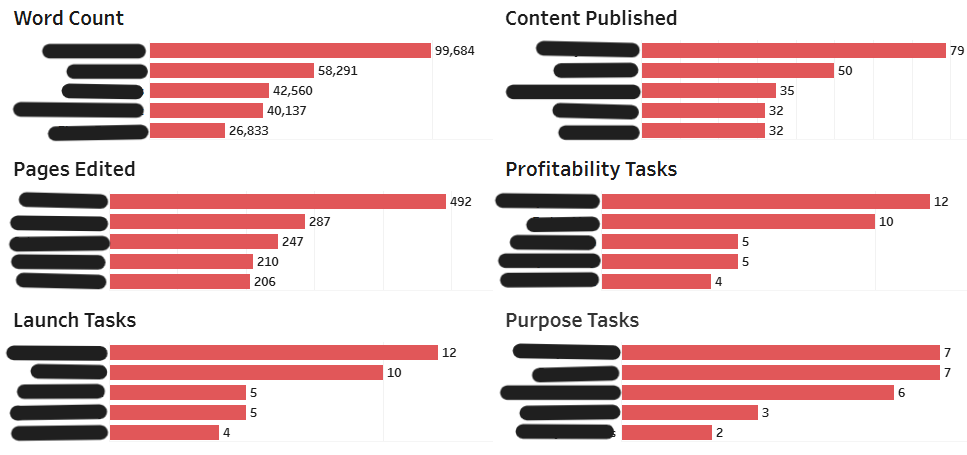
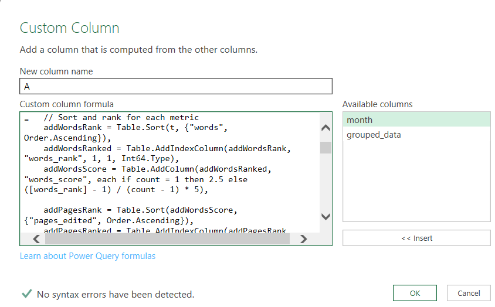
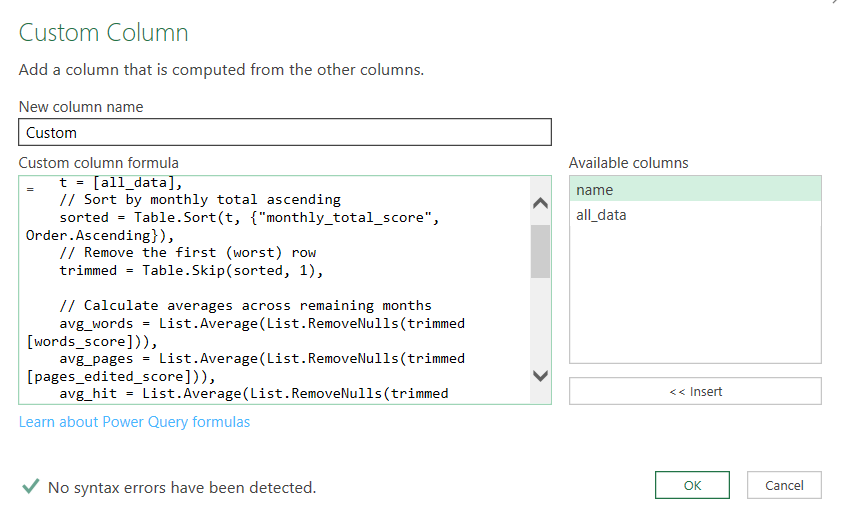
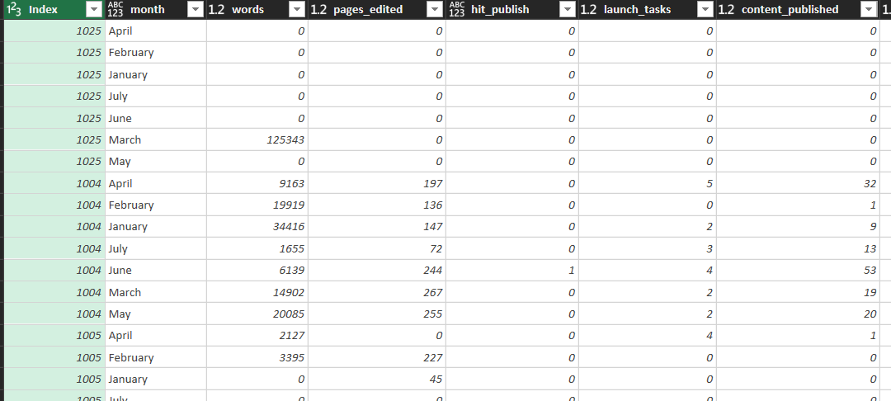
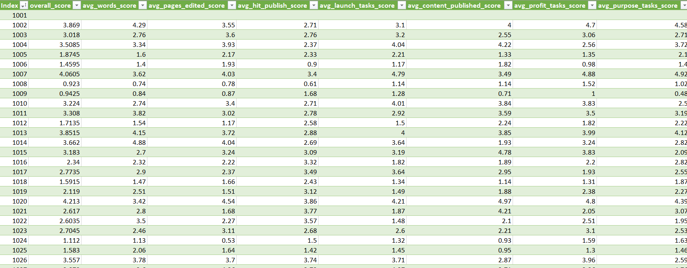

# scholarship-time-series-evalulation
Time series–based applicant evaluation for scholarship selection using weighted productivity metrics. Built in Excel using Power Query with custom scoring logic and automated transformations.

# CrossWrite Data Processing & Visualization Workflow

## Overview  
This workflow describes the end-to-end process for preparing, transforming, and visualizing monthly participant performance data from Author Nation's **CrossWrite** program. It is designed for efficiency and automation, enabling quick updates each month without redoing manual work.

Future versions will fully automate all steps once the raw data is cleaned and saved in the source file.

---

## Step 1 – Data Preparation in Excel  
1. **Import Monthly Data**  
   - Imported the monthly raw data sheet from the CrossWrite program.

2. **Manual Pre-Cleaning**  
   - Removed duplicate entries.  
   - Standardized participant names.  
   - Ensured consistent metric formatting (numbers, percentages, dates).  
   - Trimmed entries.

3. **Schema Verification**  
   - Verified all columns match the required schema for Power Query import.

---

## Step 2 – Data Transformation and Automation in Power Query  
1. **Data Import**  
   - Imported the cleaned monthly source file into Power Query.

2. **Append Historical Data**  
   - Appended the new month’s data to the historical dataset.

3. **Normalization & Calculation**  
   - Normalized metric values for comparability across months.  
   - Calculated averages, performance scores, and monthly rank per participant.  
   - Applied weighted scores according to metric importance to determine scholarship eligibility.

4. **Automation**  
   - Automated the process so future months can be appended and re-scored without manual recalculation.  
   - Future version will automate the append step as well.

---

## Step 3 – Tableau Dashboard (Separate Visualization Workflow)  
1. **Data Upload**  
   - Uploaded the **same cleaned monthly source file** (used in Power Query) into Tableau.

2. **Visualization**  
   - Created a dashboard showing the **top five leaders** for each of six metrics.

3. **Refresh Automation**  
   - Updated the dashboard monthly with the additional data set.  
   - Future version will update automatically when the new data is placed in the source file.

---

## Example Tableau Dashboard

  
*Figure 1: Anonymized Tableau dashboard showing top five leaders across six metrics for July 2025.*

---

## Additional Screenshots

  
*Figure 2: Power Query M code snapshot illustrating normalization and ranking logic.*

*Figure 3:Power Query M code snapshot averaging participant scores over active months*

 
*Figure 4: Power Query table prior to scoring transformations.*

 
*Figure 5: Anonymized Excel spreadsheet showing average metric scores and weighted overall participant scores.*

---

## Notes  
- The cleaned source file is the **single source of truth** for both Power Query processing and Tableau visualization.  
- In the future, the **Power Query step** will serve as the core automation point—future updates will require only dropping the new month’s cleaned file into the process.  
- Tableau dashboards are dynamic and require no additional formatting changes once a new month’s data sheet is uploaded.

---

*For questions or contributions, please open an issue or contact the project maintainer.*
